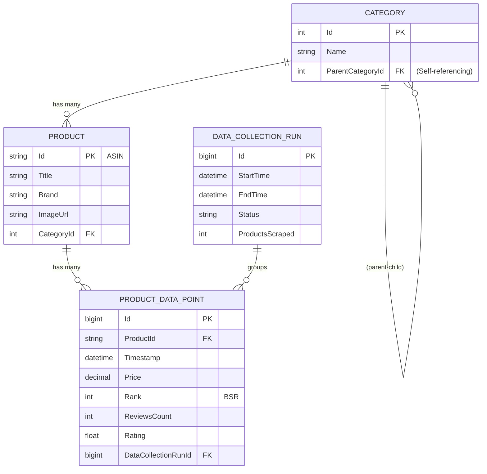

```mermaid
erDiagram
    PRODUCT {
        string Id PK "ASIN"
        string Title
        string Brand
        string ImageUrl
        int CategoryId FK
    }

    CATEGORY {
        int Id PK
        string Name
        int ParentCategoryId FK "(Self-referencing)"
    }

    PRODUCT_DATA_POINT {
        bigint Id PK
        string ProductId FK
        datetime Timestamp
        decimal Price
        int Rank "BSR"
        int ReviewsCount
        float Rating
        bigint DataCollectionRunId FK
    }

    DATA_COLLECTION_RUN {
        bigint Id PK
        datetime StartTime
        datetime EndTime
        string Status
        int ProductsScraped
    }

    PRODUCT ||--o{ PRODUCT_DATA_POINT : "has many"
    CATEGORY ||--o{ PRODUCT : "has many"
    CATEGORY ||--o{ CATEGORY : "(parent-child)"
    DATA_COLLECTION_RUN ||--o{ PRODUCT_DATA_POINT : "groups"
```
